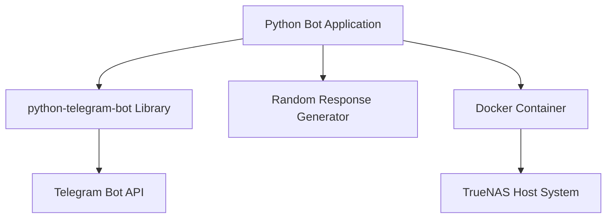
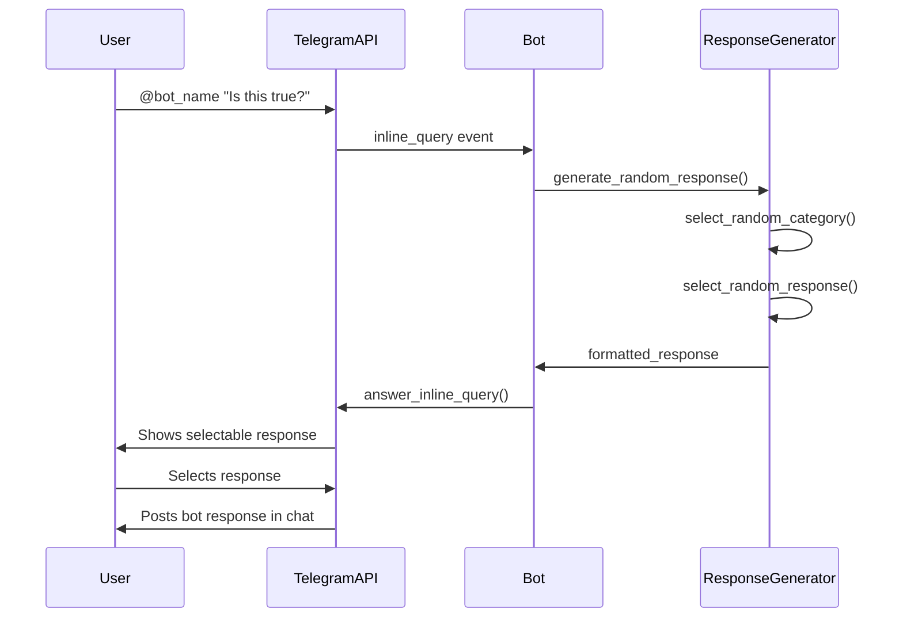
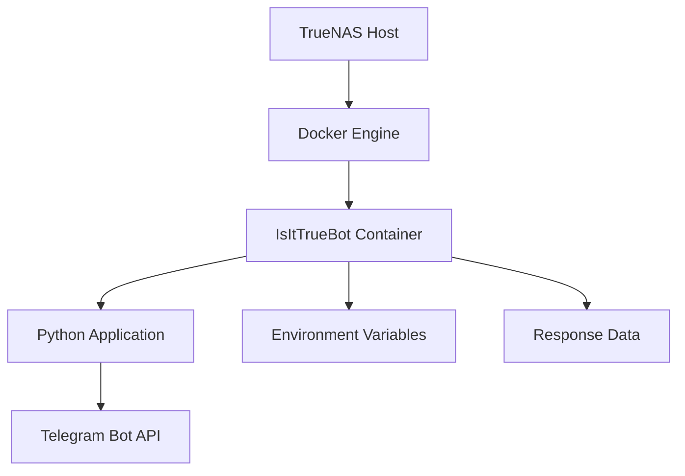
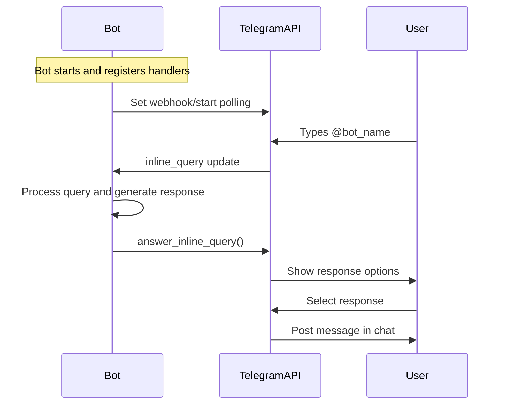

# "Is It True?" Telegram Bot Design

## Overview

A simple joke Telegram bot developed in Python that mimics fact-checking functionality through random responses. The bot parodies Grok's fact-checking feature from X (Twitter) by providing seemingly authoritative answers while actually using random selection. Users can invoke the bot via inline queries without adding it to chats or groups.

### Core Features
- Inline bot functionality accessible via "@" mention
- Random response generation with authoritative tone
- Docker deployment on TrueNAS system
- No chat/group membership required

## Technology Stack & Dependencies



### Core Dependencies
- Python 3.9+
- python-telegram-bot (v20.x)
- Docker & Docker Compose
- TrueNAS Core/Scale

## Architecture

### System Architecture

```mermaid
graph LR
    A[User in Telegram Chat] --> B[@bot_name query]
    B --> C[Telegram Bot API]
    C --> D[Python Bot Application]
    D --> E[Response Generator]
    E --> F[Random Selection Engine]
    F --> G[Predefined Responses Database]
    G --> H[Formatted Response]
    H --> I[Inline Query Result]
    I --> C
    C --> A
```

### Application Structure

```
IsItTrueBot/
├── src/
│   ├── bot.py              # Main bot application
│   ├── response_generator.py   # Random response logic
│   └── responses/
│       ├── positive.py     # "True" responses
│       ├── negative.py     # "False" responses
│       └── uncertain.py    # "Uncertain" responses
├── config/
│   └── settings.py         # Bot configuration
├── Dockerfile
├── docker-compose.yml
└── requirements.txt
```

## Bot Functionality Design

### Inline Query Handling



### Response Categories

| Category | Probability | Response Style |
|----------|-------------|----------------|
| Positive Confirmation | 40% | "Yes, this is true", "Confirmed by multiple sources" |
| Negative Denial | 40% | "No, this is false", "Debunked by fact-checkers" |
| Uncertain/Partial | 20% | "Partially true", "Needs more context" |

### Response Templates (Russian Language)

#### Positive Responses (Положительные ответы)
- "✅ Да, это абсолютно правда согласно проверенным источникам"
- "✅ Подтверждено: данная информация проверена в нескольких базах данных"
- "✅ Правда. Сверено с надежными фактчекинговыми организациями"
- "✅ Подтверждена достоверность независимыми источниками"
- "✅ Данное утверждение фактически корректно"
- "✅ Информация соответствует действительности"
- "✅ Проверено экспертами - это правда"

#### Negative Responses (Отрицательные ответы)
- "❌ Нет, это опровергнуто фактчекерами"
- "❌ Ложь. Это противоречит проверенной информации"
- "❌ Неверно. Множество источников подтверждают, что это не так"
- "❌ Данное утверждение полностью опровергнуто"
- "❌ Результат фактчека: Ложь"
- "❌ Дезинформация. Не соответствует фактам"
- "❌ Проверено экспертами - это неправда"

#### Uncertain Responses (Неопределенные ответы)
- "⚠️ Частично правда, но не хватает важного контекста"
- "⚠️ Смешанные результаты - некоторые аспекты точны, другие нет"
- "⚠️ Неокончательно - недостаточно надежных источников"
- "⚠️ Требует дополнительной проверки"
- "⚠️ Спорная информация - мнения экспертов расходятся"
- "⚠️ Нужны дополнительные данные для окончательного вывода"

## Bot Command Interface

### Inline Query Commands

```mermaid
graph TD
    A[User types @IsItTrueBot] --> B[Bot shows command options]
    B --> C["Это правда?" / "Is this true?"]
    C --> D[User selects command]
    D --> E[Bot generates random response]
    E --> F[User can share response in chat]
```

### Command Structure
- Primary command: **"Это правда?"** (Russian)
- Display format: Shows as selectable inline option
- Response format: Authoritative statement in Russian with emoji indicator
- Language: All responses exclusively in Russian

## Data Models & Response Management

### Response Model
```python
class BotResponse:
    def __init__(self, text: str, category: str, confidence_level: str):
        self.text = text
        self.category = category  # 'positive', 'negative', 'uncertain'
        self.confidence_level = confidence_level
        self.timestamp = datetime.now()
```

### Response Categories Distribution
- **Positive responses**: 40% probability
- **Negative responses**: 40% probability  
- **Uncertain responses**: 20% probability

## Docker Deployment Architecture

### Container Structure



### Deployment Configuration

#### Dockerfile Structure
```dockerfile
FROM python:3.9-slim
WORKDIR /app
COPY requirements.txt .
RUN pip install -r requirements.txt
COPY src/ ./src/
COPY config/ ./config/
CMD ["python", "src/bot.py"]
```

#### Docker Compose Setup
```yaml
version: '3.8'
services:
  isittruebot:
    build: .
    environment:
      - BOT_TOKEN=${BOT_TOKEN}
      - LOG_LEVEL=INFO
    restart: unless-stopped
    networks:
      - telegram-bots
```

### TrueNAS Integration
- Deploy as Docker container via TrueNAS Apps or Portainer
- Persistent storage for logs (optional)
- Network access for Telegram API communication
- Environment variable management for bot token

## Business Logic Layer

### Core Bot Logic Flow

```mermaid
flowchart TD
    A[Bot Receives Inline Query] --> B{Query Text Present?}
    B -->|No| C[Show Default Command Options]
    B -->|Yes| D[Process Query]
    D --> E[Generate Random Response]
    E --> F[Format Response with Authority Tone]
    F --> G[Return Inline Query Result]
    G --> H[User Selects and Shares]
    
    C --> I[Display "Это правда?" Option]
    I --> J[User Selects Command]
    J --> E
```

### Response Generation Algorithm

```python
def generate_response():
    # Weighted random selection
    categories = {
        'positive': 0.4,
        'negative': 0.4, 
        'uncertain': 0.2
    }
    
    selected_category = random.choices(
        list(categories.keys()), 
        weights=list(categories.values())
    )[0]
    
    response = random.choice(RESPONSES[selected_category])
    return format_authoritative_response(response)
```

### Response Formatting Strategy
- Add authoritative language in Russian ("согласно источникам", "подтверждено", "проверено")
- Include confidence indicators (✅, ❌, ⚠️)
- Maintain serious tone despite random nature
- Simulate fact-checking process language in Russian
- Use formal Russian language style for credibility

## API Integration Layer

### Telegram Bot API Integration



### Bot API Methods Used
- `answer_inline_query()`: Return response options to user
- `InlineQueryResultArticle`: Format response as selectable article
- Webhook or polling for receiving updates

### Error Handling Strategy
- Graceful fallback responses for API errors
- Logging for debugging deployment issues
- Retry mechanism for temporary API failures
- Default responses when random generation fails

## Testing Strategy

### Unit Testing Approach

#### Response Generation Tests
```python
def test_response_distribution():
    # Test that response categories follow expected distribution
    responses = [generate_response() for _ in range(1000)]
    positive_count = sum(1 for r in responses if r.category == 'positive')
    assert 350 <= positive_count <= 450  # ~40% ±10%

def test_response_formatting():
    # Ensure all responses maintain authoritative tone
    response = generate_response()
    assert any(keyword in response.text.lower() for keyword in 
              ['проверено', 'подтверждено', 'источник', 'фактчек'])
```

#### Bot Integration Tests
```python
def test_inline_query_handling():
    # Mock inline query and verify response structure
    mock_query = create_mock_inline_query("Test statement")
    result = bot.handle_inline_query(mock_query)
    assert isinstance(result, InlineQueryResultArticle)
    assert result.title == "Это правда?"
```

### Integration Testing
- Test bot deployment in Docker container
- Verify Telegram API connectivity
- Test inline query functionality end-to-end
- Validate response delivery to users

### Manual Testing Checklist
- [ ] Bot responds to @bot_name mentions
- [ ] "Это правда?" command appears in options
- [ ] Random responses generated with proper distribution
- [ ] Responses maintain authoritative tone
- [ ] Bot works without being added to chats
- [ ] Docker container starts and runs stably on TrueNAS