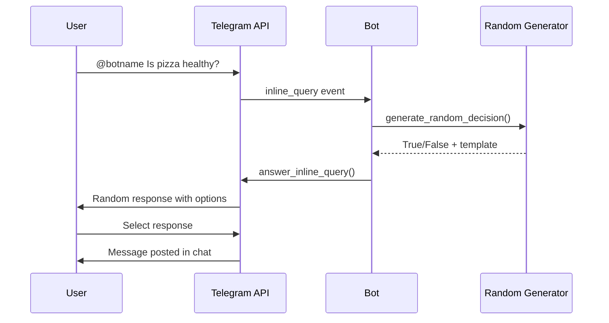

# Telegram Joke Bot Design Document

## Overview

A simple Telegram bot written in Python that provides humorous verification of information through honest randomness. The bot responds to user queries with random "true" or "false" answers, serving as an entertainment tool for fact-checking any statement or question. Users can invoke the bot via inline queries using "@" mention without needing to add it to their chats.

**Key Features:**
- Inline query support for universal access
- Random true/false responses with entertaining messages
- Lightweight Python implementation
- Docker containerization for easy deployment
- TrueNAS system compatibility

## Technology Stack & Dependencies

- **Runtime**: Python 3.9+
- **Telegram API**: python-telegram-bot library
- **Containerization**: Docker
- **Deployment**: TrueNAS Docker containers
- **Random Generation**: Python's built-in `random` module

## Architecture

### Bot Architecture Diagram

```mermaid
graph TB
    A[User in Any Chat] -->|@botname query| B[Telegram API]
    B --> C[Bot Application]
    C --> D[Random Response Generator]
    D --> E[Response Templates]
    C --> F[Inline Query Handler]
    F --> B
    B --> A
    
    subgraph "Docker Container"
        C
        D
        E
        F
    end
    
    subgraph "TrueNAS System"
        G[Docker Engine]
        H[Bot Container]
        I[Configuration Volume]
    end
```

### Core Components

1. **Bot Application Core**
   - Main bot instance initialization
   - Token management and authentication
   - Error handling and logging

2. **Inline Query Handler**
   - Processes "@botname" mentions from any chat
   - Parses user queries
   - Returns formatted responses

3. **Random Response Generator**
   - Generates random boolean decisions
   - Selects appropriate response templates
   - Adds humor and personality to responses

4. **Response Templates**
   - Collection of entertaining "true" responses
   - Collection of entertaining "false" responses
   - Randomized selection logic

## Bot Functionality

### Inline Query Processing

The bot responds to inline queries with the following flow:



### Response Categories

**True Responses (50% probability):**
- "✅ Абсолютно верно! Мой честный рандом подтверждает!"
- "✅ Да, это правда! Рандом не врёт!"
- "✅ Подтверждаю! Источник: честный генератор случайных чисел"
- "✅ 100% достоверная информация (по мнению рандома)"

**False Responses (50% probability):**
- "❌ Нет, это неправда! Рандом опровергает!"
- "❌ Ложь! Мой честный алгоритм говорит 'нет'"
- "❌ Недостоверная информация! Источник: генератор случайности"
- "❌ Рандом категорически не согласен!"

### Bot Commands

| Command | Description | Access Level |
|---------|-------------|--------------|
| `/start` | Welcome message and instructions | All users |
| `/help` | Usage instructions for inline queries | All users |
| `/about` | Bot information and disclaimer | All users |

## Docker Configuration

### Container Specifications

- **Base Image**: `python:3.9-slim`
- **Working Directory**: `/app`
- **Port Exposure**: Not required (polling mode)
- **Environment Variables**: 
  - `BOT_TOKEN`: Telegram bot token
  - `LOG_LEVEL`: Logging level (default: INFO)

### Volume Mounts

```
/app/config:/app/config (read-only)
/app/logs:/app/logs (read-write)
```

### Resource Requirements

- **CPU**: 0.1 cores
- **Memory**: 128MB
- **Storage**: 100MB

## TrueNAS Deployment

### Docker Compose Configuration

```yaml
version: '3.8'
services:
  telegram-joke-bot:
    build: .
    container_name: isittrue-bot
    restart: unless-stopped
    environment:
      - BOT_TOKEN=${BOT_TOKEN}
      - LOG_LEVEL=INFO
    volumes:
      - ./config:/app/config:ro
      - ./logs:/app/logs:rw
    networks:
      - bot-network

networks:
  bot-network:
    driver: bridge
```

### TrueNAS Integration

1. **App Installation**
   - Custom app deployment via Docker Compose
   - Environment variable configuration through TrueNAS UI
   - Volume mapping to TrueNAS datasets

2. **Monitoring**
   - Container health checks
   - Log rotation and management
   - Resource usage monitoring

3. **Security**
   - Bot token stored as TrueNAS secret
   - Network isolation
   - Read-only configuration volumes

## API Integration

### Telegram Bot API Endpoints

- **getUpdates**: Polling for new messages and inline queries
- **answerInlineQuery**: Responding to inline queries
- **sendMessage**: Sending direct messages for commands

### Rate Limiting

- Respect Telegram API limits (30 messages/second)
- Implement exponential backoff for API errors
- Queue management for high-traffic scenarios

## Error Handling & Logging

### Error Categories

1. **API Errors**
   - Network connectivity issues
   - Telegram API rate limiting
   - Invalid bot token

2. **Application Errors**
   - Malformed inline queries
   - Random generation failures
   - Template loading errors

### Logging Strategy

```
Level: INFO
Format: [TIMESTAMP] [LEVEL] [COMPONENT] MESSAGE
Rotation: Daily, keep 7 days
Location: /app/logs/bot.log
```

## Security Considerations

1. **Token Protection**
   - Bot token stored as environment variable
   - No hardcoded credentials in source code
   - TrueNAS secrets management integration

2. **Input Validation**
   - Sanitize inline query inputs
   - Prevent injection attacks
   - Rate limiting per user

3. **Network Security**
   - Container network isolation
   - HTTPS-only API communication
   - Minimal container permissions

## Testing Strategy

### Unit Testing

- Random response generation logic
- Template selection algorithms
- Error handling scenarios
- Configuration loading

### Integration Testing

- Telegram API interaction
- Docker container functionality
- TrueNAS deployment process
- End-to-end inline query flow

### Performance Testing

- Response time measurements
- Memory usage monitoring
- Concurrent user handling
- API rate limit compliance

## Configuration Management

### Bot Configuration

```yaml
# config/bot.yaml
bot:
  name: "IsItTrueBot"
  description: "Честный рандом для проверки фактов"
  polling_interval: 1.0
  
responses:
  true_templates:
    - "✅ Абсолютно верно! Мой честный рандом подтверждает!"
    - "✅ Да, это правда! Рандом не врёт!"
  
  false_templates:
    - "❌ Нет, это неправда! Рандом опровергает!"
    - "❌ Ложь! Мой честный алгоритм говорит 'нет'"

logging:
  level: INFO
  max_file_size: 10MB
  backup_count: 7
```

## Maintenance & Monitoring

### Health Checks

- Bot responsiveness verification
- API connectivity monitoring
- Container resource usage
- Log file analysis

### Update Procedures

1. Code updates via Git pull
2. Container rebuild and restart
3. Configuration validation
4. Rollback procedures if needed

### Backup Strategy

- Configuration files backup
- Log files archival
- Container image versioning
- TrueNAS dataset snapshots